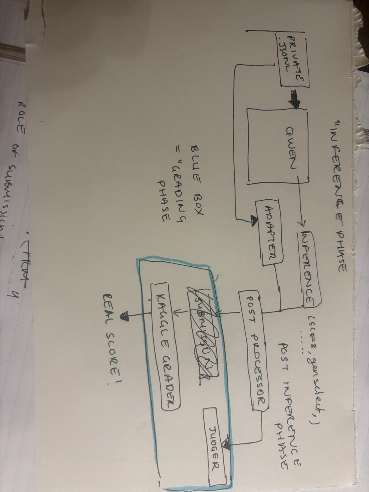
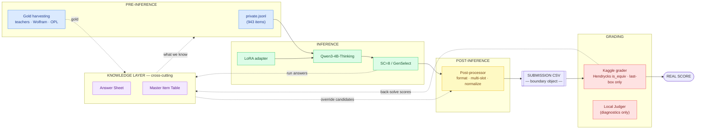

# PIPELINE — The Blueprint for This Repo

**This is the HEART of the repo.** Every file, folder, and artifact has a home defined by
its place in this pipeline. When deciding where something belongs, ask: *which phase produces
or consumes it?* (Source: Rain's hand-drawn pipeline, 2026-05-28 — `pipeline_diagram.jpeg`.)

---

## The four phases (diagram-as-code — renders natively on GitHub)

*Original hand-drawn source: `pipeline_diagram.jpeg`. The Mermaid above is the maintainable version — edit it as text and GitHub re-renders.*

## What lives in each phase

| Phase | Components | Canonical artifacts | Repo location(s) today | Answers Q# |
|---|---|---|---|---|
| **PRE-INFERENCE** | `private.jsonl`; gold-harvesting (teachers, Wolfram, OPL) | (consumes KNOWLEDGE LAYER) | `private.jsonl`, `data/search/` | 2 (in part) |
| **INFERENCE** | Qwen base + LoRA adapters; SC sampling; GenSelect | RUN_REGISTRY, RUN_ANSWER_MATRIX, ADAPTER_REGISTRY | `inference/` (scripts, results, runs, adapters), `checkpoints/` | 4, 5, 7, 10, 11 |
| **POST-INFERENCE** | Post-processor: format fix, multi-slot expansion, normalization | postprocessing findings/levers | `postprocessing/` | (the levers) |
| **GRADING** | Kaggle grader (Hendrycks `is_equiv`) + local Judger → real score | **GRADER_SPEC** | `grading/`, `judger.py` | 6 |
| *seam* | the **submission CSV** (post-inf emits → grading consumes) | submission REGISTRY + daily-5 plan | `submission/` | 8, 9 |
| **KNOWLEDGE LAYER** *(cross-cutting — not a phase)* | aggregates run answers + grading feedback + gold; feeds pre-inference & post-processing | **MASTER_ITEM_TABLE, ANSWER_SHEET** | `data/`, `data/answer_sheet/` | 1, 2, 3 |

## Two structural decisions (LOCKED 2026-05-28)

1. **The submission is a boundary object, not a phase.** It's what post-inference emits and grading
   consumes — it sits on the seam. That's why "purpose of each submission" (Q8) and "daily-5 goals" (Q9)
   straddle phases 3 and 4.

2. **There is a knowledge feedback loop.** ANSWER_SHEET and MASTER_ITEM_TABLE are not produced by any one
   phase — they are built FROM grading outputs (back-solving probable gold from submission scores) + run
   outputs + teacher/Wolfram gold, and they feed BACK into pre-inference ("what we know") and into
   post-processing (override candidates). The pipeline is linear for one pass; the knowledge layer wraps
   the whole loop and gets smarter every submission. (Dashed arrow above.)

## How to use this blueprint

- **Placing a file:** identify the phase that produces/consumes it → that phase's folder is its home.
- **Answering a "where is X?" question:** find X in the artifacts column above → follow to its location.
- **The 11 organization questions** all resolve to a (phase, artifact) coordinate — see the table.
