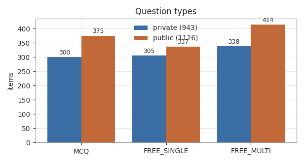
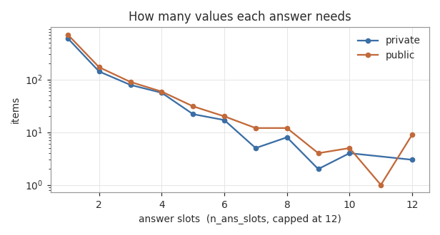
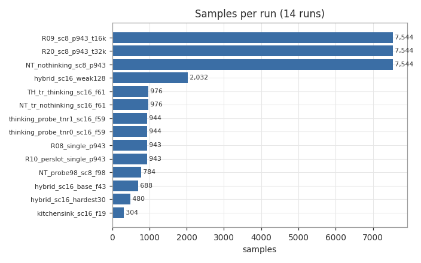
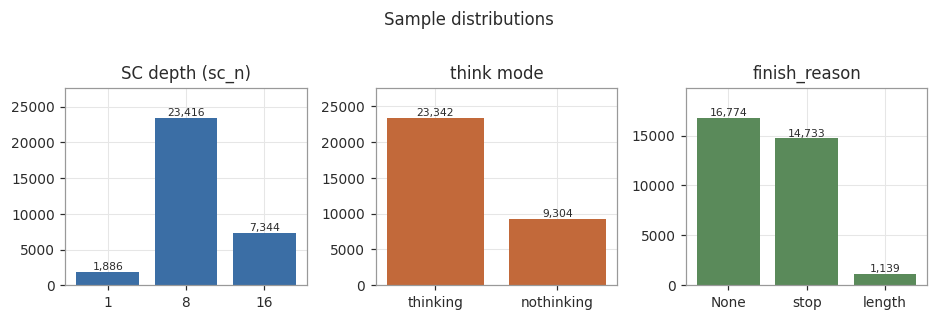
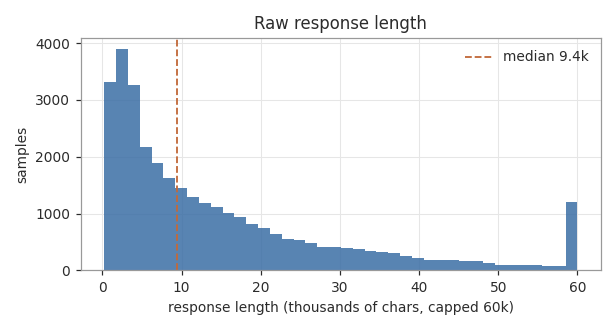
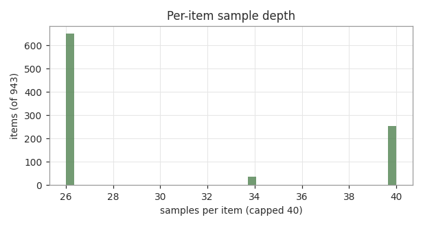

# Data — visual preview

> A look-at-it companion to [`README.md`](README.md) (the prose overview) and the two `DATASHEET.md` files (the formal spec). Sample rows, field dictionaries, and distribution charts so you can eyeball both datasets in a minute. **Regenerate:** `python3 data/make_preview.py`.

---

## 1. `data/raw/` — questions & answers

**943 private** (the held-out test set) + **1,126 public** (labeled reference). One row per question.

### Data fields

| field | type | example | notes |
|---|---|---|---|
| `id` | int | `784` | unique within a set (private 0–942, public 0–1125) |
| `question` | str | *"A company's stock…"* | problem text, verbatim |
| `options` | list[str] | `["A) 12", "B) 15", …]` | MCQ choices; `[]` for free-form |
| `question_type` | str | `MCQ` | `MCQ` / `FREE_SINGLE` / `FREE_MULTI` (derived) |
| `n_ans_slots` | int | `2` | number of required values (derived) |
| `is_matharena` | int | `0` | private only: 1 if from MathArena (50 items) |
| `answer` | str \| list[str] | `["4", "16"]` | scalar for single, list for multi |

### Data instances — one of each question type (private)

<small>**MCQ**</small>

> item id **1**  ·  `MCQ`  ·  n_ans_slots = 1
> 
> **Q:** Assuming the weights corresponding to the sign values are reduced by 1/10, then the arithmetic mean is ().
> 
> **options:** `Unchanged`  `Increased by ten percent`  `Reduced by one percent`  `Increased by one percent`  `Decreased by ten percent`  `Halved`  `Unable to determine`  `Doubled`  `Decreased by five percent`  `Expanded tenfold`
> 
> **answer:** `A`  *(scalar)*

<small>**FREE_SINGLE**</small>

> item id **6**  ·  `FREE_SINGLE`  ·  n_ans_slots = 1
> 
> **Q:** A person is standing straight on the ground, looking up at an airplane which is taking off. His eyes is ${5.5\ {\rm ft}}$ from the ground. Horizontally, the person is ${176\ {\rm ft}}$ away from the airplane. The angle of elevation from his eyes to the airplane is $39$ degrees. Find the height of the airplane. Round your answer to two decimal places if needed. The height of the airplane is [ANS]ft.
> 
> **answer:** `148.022`  *(scalar)*

<small>**FREE_MULTI**</small>

> item id **0**  ·  `FREE_MULTI`  ·  n_ans_slots = 2
> 
> **Q:** Use the order of operations to simplify: a) $[13-(11-11)]-[8-(5-6)]=$ [ANS] b) $4 \cdot 3-2+2 \cdot 3=$ [ANS]
> 
> **answer:** `4, 16`  *(list)*

### Distributions

 

| question_type (private) | count | % | |
|---|---:|---:|:--|
| MCQ | 300 | 31.8% | `████████████████████▁▁` |
| FREE_SINGLE | 305 | 32.3% | `████████████████████▁▁` |
| FREE_MULTI | 338 | 35.8% | `██████████████████████` |

| question_type (public) | count | % | |
|---|---:|---:|:--|
| MCQ | 375 | 33.3% | `████████████████████▁▁` |
| FREE_SINGLE | 337 | 29.9% | `██████████████████▁▁▁▁` |
| FREE_MULTI | 414 | 36.8% | `██████████████████████` |

**n_ans_slots** — private: min 1, median 1, max 18  ·  public: min 1, median 1, max 42. Most items need 1 value; a long tail needs many (private up to 18, public up to 42).

---

## 2. `data/samples/` — self-consistency inference samples

**32,646 samples** across **14 runs**, one row per raw model sample (base `Qwen3-4B-Thinking-2507`, private set). All **943** items covered. The `response` text is stored **raw** — no extracted/voted answer (that's the research point).

### Runs at a glance — the inventory

One row per run; this is the metadata bird's-eye. `coverage` = how many of the 943 items the run targeted (full-943 vs a hard-item subset); `SC` = self-consistency depth.

| run_id | SC | mode | budget | coverage | samples | date | prompt | what it is |
|---|--:|---|--:|---|--:|---|---|---|
| `R08_single_p943` | 1 | thinking | 16k | **943** · full | 943 | — | v1 | single-sample (SC1), v1 prompt, 16k budget, … |
| `R10_perslot_single_p943` | 1 | thinking | 16k | **943** · full | 943 | — | v3_perslot | single-sample (SC1), v3-perslot prompt, 16k, … |
| `NT_nothinking_sc8_p943` | 8 | nothinking | 8k | **943** · full | 7,544 | 2026-05-27 | nothinking_prefill | SC8 NoThinking prefill, 8k budget, full 943 |
| `R09_sc8_p943_t16k` | 8 | thinking | 16k | **943** · full | 7,544 | — | v1 | SC8, v1 prompt, 16k budget, full 943 |
| `R20_sc8_p943_t32k` | 8 | thinking | 32k | **943** · full | 7,544 | — | v1 | SC8, v1 prompt, 32k budget, full 943 (best i … |
| `NT_probe98_sc8_f98` | 8 | nothinking | 8k | 98 · subset | 784 | — | nothinking_prefill | SC8 NoThinking probe, 98 items |
| `hybrid_sc16_weak128` | 16 | thinking | — | 127 · subset | 2,032 | 2026-05-26 | — | SC16 thinking, 127 weak items |
| `NT_tr_nothinking_sc16_f61` | 16 | nothinking | 8k | 61 · subset | 976 | 2026-05-26 | nothinking_prefill | SC16 NoThinking targeted-rescue, 61 hard ite … |
| `TH_tr_thinking_sc16_f61` | 16 | thinking | — | 61 · subset | 976 | 2026-05-26 | v1 | SC16 thinking targeted-rescue, 61 hard items … |
| `thinking_probe_tnr0_sc16_f59` | 16 | thinking | — | 59 · subset | 944 | 2026-05-31 | — | SC16 thinking probe, 59 items, GPU shard tnr … |
| `thinking_probe_tnr1_sc16_f59` | 16 | thinking | — | 59 · subset | 944 | 2026-05-31 | — | SC16 thinking probe, 59 items, GPU shard tnr … |
| `hybrid_sc16_base_f43` | 16 | thinking | — | 43 · subset | 688 | — | — | SC16 thinking, 43 items |
| `hybrid_sc16_hardest30` | 16 | thinking | — | 30 · subset | 480 | 2026-05-26 | — | SC16 thinking, 30 hardest items |
| `kitchensink_sc16_f19` | 16 | thinking | — | 19 · subset | 304 | 2026-05-31 | — | SC16 kitchen-sink, 19 items (late run) |

**Coverage × SC depth** — *where* each depth exists. The structural fact for the research: full-943 coverage exists only at SC@1 and SC@8; **every SC@16 run is a hard-item subset**, so per-item depth is uneven (reconstruct it from `run_id` + `sc_n`).

| SC depth | full-943 runs | hard-subset runs | distinct items w/ ≥1 sample |
|---|---|---|---:|
| **SC@1** | `R08_single_p943`, `R10_perslot_single_p943` | — | 943 |
| **SC@8** | `NT_nothinking_sc8_p943`, `R09_sc8_p943_t16k`, `R20_sc8_p943_t32k` | `NT_probe98_sc8_f98` (98 items) | 943 |
| **SC@16** | — | 8 runs (19–127 items each) | 255 |

**Samples by mode × SC depth** — the 32,646 samples cross-tabulated.

| samples | SC@1 | SC@8 | SC@16 | **all** |
|---|--:|--:|--:|--:|
| nothinking | 0 | 8,328 | 976 | 9,304 |
| thinking | 1,886 | 15,088 | 6,368 | 23,342 |
| **all** | 1,886 | 23,416 | 7,344 | 32,646 |



### Data fields

| field | type | example | notes |
|---|---|---|---|
| `sample_uid` | str | `R20_sc8_p943_t32k:600:3` | `run_id:item_id:sample_index` (primary key) |
| `run_id` | str | `R20_sc8_p943_t32k` | which inference run |
| `item_id` | int | `600` | joins to `raw/private_answers.id` |
| `sample_index` | int | `3` | which sample within (item, run) |
| `sc_n` | int | `8` | self-consistency depth of the run (1 / 8 / 16) |
| `think_mode` | str | `thinking` | `thinking` or `nothinking` (closed-`<think>` prefill) |
| `model_variant` | str | `base` | base model (adapter/sft extend later) |
| `response` | str | *(long)* | the raw generation, untouched |
| `gen_tokens` | int | `4173` | generated token count (null where unrecorded) |
| `finish_reason` | str | `stop` | `stop` / `length` (truncated) / null |
| `temperature` | float | `0.6` | sampling temperature |

### Data instances — two real samples (head + tail)

`R09_sc8_p943_t16k`  ·  item **0**  ·  sample 1  ·  sc_n=8  ·  thinking  ·  finish=stop  ·  3,110 chars

```
Okay, let's tackle part a) first. The problem is [13 - (11 - 11)] - [8 - (5 - 6)]. Hmm, order of operations, so I need to do the innermost parentheses first, then work my way out. Let me write it down step by step.

First, look at the first bracket: [13 - (11 - 11)]. Let's handle the innermost parentheses here, which is (11 - 11). 11 minus 11 is 0. So that simplifies the first part to 13 - 0. Which is 13. Okay, so the first bracket simplifies to 13.

Now the second bracket: [8 - (5 - 6)]. Again, innermost parentheses first: (5 - 6). 5 minus 6 is -1. So t

   […  2,330 chars elided  …]

dot 3 = 6$

#### Step 2: Substitute and simplify from left to right
$$
12 - 2 + 6 = (12 - 2) + 6 = 10 + 6 = 16
$$

✅ **Final Answer for part b):** $\boxed{16}$

---

### ✅ Final Answers:

a) $\boxed{4}$  
b) $\boxed{16}$
```

`NT_probe98_sc8_f98`  ·  item **5**  ·  sample 0  ·  sc_n=8  ·  nothinking  ·  finish=stop  ·  3,075 chars

```
To solve this problem, we will compute the **Sum of Squares Between Groups (SSTR)**, **Sum of Squares Error (SSE)**, **Mean Square Between Groups (MSTR)**, **Mean Square Error (MSE)**, and the **F-statistic** using ANOVA principles.

---

### **Given Information**

- Number of groups: $ k = 5 $ (strains A, B, C, D, E)
- Total number of observations: $ n = 20 $
- Each group has $ n_i = 4 $ observations
- Overall mean: $ \bar{x}_{\text{total}} = 16.35 $

We are provided with:

| Group | Mean ($ \bar{x}_i $) | Std Dev ($ s_i $) |
|-------|------------------

   […  2,295 chars elided  …]

on context; here it's given to one decimal place.)

---

### ✅ Final Answers:

**(a)** $ \boxed{541.3} $  
**(b)** $ \boxed{63.246} $  
**(c)** $ \boxed{135.325} $  
**(d)** $ \boxed{4.2164} $  
**(e)** $ \boxed{32.1} $
```

### Distributions



 

| sc_n | count | % | |
|---|---:|---:|:--|
| 1 | 1,886 | 5.8% | `██▁▁▁▁▁▁▁▁▁▁▁▁▁▁▁▁▁▁▁▁` |
| 8 | 23,416 | 71.7% | `██████████████████████` |
| 16 | 7,344 | 22.5% | `███████▁▁▁▁▁▁▁▁▁▁▁▁▁▁▁` |

| think_mode | count | % | |
|---|---:|---:|:--|
| thinking | 23,342 | 71.5% | `██████████████████████` |
| nothinking | 9,304 | 28.5% | `█████████▁▁▁▁▁▁▁▁▁▁▁▁▁` |

| finish_reason | count | % | |
|---|---:|---:|:--|
| null | 16,774 | 51.4% | `██████████████████████` |
| stop | 14,733 | 45.1% | `███████████████████▁▁▁` |
| length | 1,139 | 3.5% | `█▁▁▁▁▁▁▁▁▁▁▁▁▁▁▁▁▁▁▁▁▁` |

**response length** (chars): min 246 · median 9,377 · max 140,858.  **per-item depth:** min 26 · median 26 · max 114 samples/item.

---

*Generated by [`make_preview.py`](make_preview.py). Charts in [`preview/`](preview/). For the formal record see `raw/DATASHEET.md` and `samples/DATASHEET.md`.*
